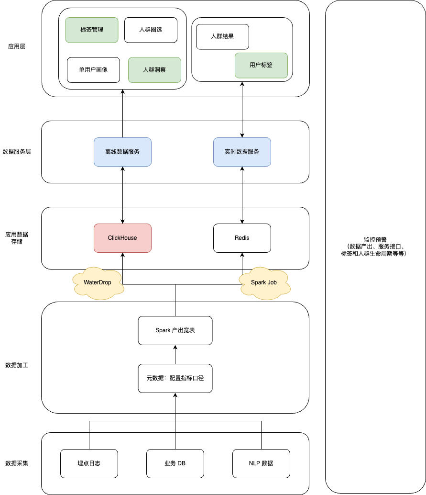

## User Portrait  

### 1. Background  

As a leading platform in the **social networking** domain, our core mission is to **foster deep social connections** by accurately matching users based on their **interests, personalities, and emotional needs**. However, traditional social platforms primarily rely on **demographic attributes** (e.g., age, gender) for user matching, which often fails to meet users' expectations for **"spiritual resonance"**. To address this limitation, we designed a **granular user portrait system** with the following objectives:  

- **Enhance user matching accuracy and retention** by understanding user preferences at a deeper level.  
- **Optimize content recommendations** to improve engagement and personalized user experiences.  
- **Unlock high-value commercial opportunities**, such as **targeted advertising, premium services, and membership-based monetization**.  

### 2. **Role & Responsibilities**  

As the **project owner**, my responsibilities included:  

1. **Architecting and developing** the **data infrastructure** for the user portrait system.  
2. **Providing a unified, high-performance data query service** to support multiple business departments.  
3. **Establishing a comprehensive monitoring system** to ensure **accuracy, efficiency, and high availability**.  

### 3. Tag Design  

#### 3.1 Classification by Type  

- **Basic Tags**  
  - Static user attributes: **age, gender, location**, etc.  

- **Behavioral Tags**  
  - Derived from user activity: **login frequency (last X days), last group chat interaction time**, etc.  

- **Interest Tags**  
  - **Algorithmically generated** based on **demographic data (e.g., age, gender)** and **behavioral patterns (e.g., browsing history, purchase records)**, providing actionable insights for **personalization and business decision-making**.  

#### 3.2 Classification by Timeliness  

- **Offline Tags**  
  - **T+1 latency**: Data is extracted from business databases daily, processed in **Hive** using batch scripts, and loaded into **ClickHouse** to support audience segmentation and historical data queries.  

- **Real-time Tags**  
  - **T+1min latency** (depending on data reporting frequency):  
    - **Flink + Kafka** processes real-time events.  
    - Data is stored in **Redis** for fast retrieval.  
    - A **unified data service** ensures **10–50ms query response times**.  

### 4. System Architecture  

| Component | Technologies Used |
|-----------|------------------|
| **Frontend** | JavaScript, Vue |
| **Backend** | Java, Spring Boot |
| **Data Processing** | Java, Flink, Spark |
| **Storage** | MySQL, Hive, ClickHouse, Redis |
| **Distributed Services** | Apache Dubbo |
| **Configuration Management** | Apache Apollo |

### 5. Project Timeline  

- **06/2021 – 09/2021**  
  1. Conducted a **feasibility study**, analyzing **industry-leading solutions** (e.g., Alibaba Cloud).  
  2. Designed the **platform architecture** and finalized the **implementation roadmap**.  
  3. Coordinated **cross-team collaboration** to launch **version 1.0**.  

- **09/2021 – 12/2021**  
  1. Deployed the **unified data query service**, achieving **10–50ms response times**.  
  2. Developed **advanced audience segmentation features**, enabling **precise user targeting**.  

- **01/2022 – 03/2022**  
  1. Implemented **end-to-end monitoring**, ensuring **99.99% availability, accuracy, and timeliness**.  
  2. Introduced **secondary caching**, reducing **Redis load** and **improving response speed by 30%**.  
  3. Optimized **Redis storage efficiency**, using **compression for long-text data**, reducing **storage costs by 20%**.  

### 6. Key Challenges  

1. Designed and implemented an **enterprise-grade user portrait system** from the ground up.  
2. Migrated **query services from Kubernetes (K8s) to Dubbo**, ensuring **high stability** during service restarts.  
3. Established a **platform-wide monitoring framework** to enforce **SLA compliance** and detect anomalies in real-time.  

### 7. Key Achievements  

1. **Quarterly average of 600+ newly created audience segments**, processing **9,000+ computational runs in Q2**.  
2. **Supported 40+ daily business strategies**, covering **50% of business operations**.  
3. **Handled 1.4 billion+ daily queries** for **advertising** and **800 million+ queries** for other business functions.  

### 8. Future Roadmap  

To align with **Volcano Engine’s** advanced **user behavior analysis platform**, the next steps include:  

- **Migrating data from ClickHouse to StarRocks**, enhancing **multi-table join efficiency** for complex queries.  
- **Leveraging Flink for real-time user behavior ingestion**, enabling a **unified querying experience** for **user attributes, behavioral data, and strategic decision-making**.  

### 9. System Architecture Diagram  
  
